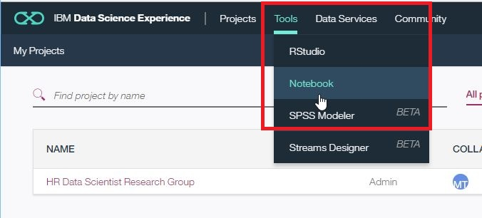
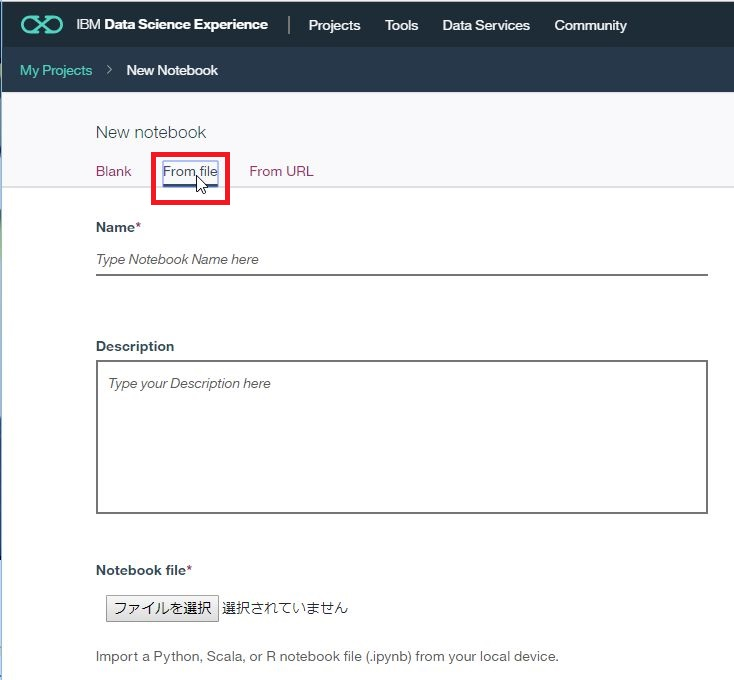
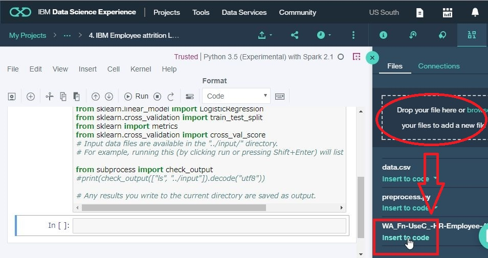
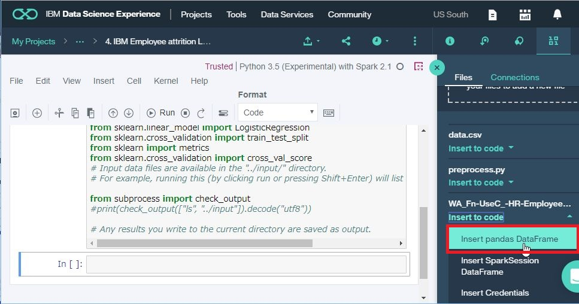
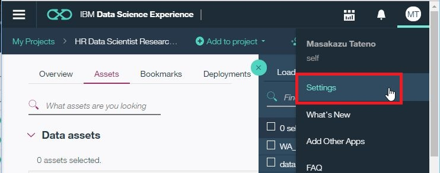
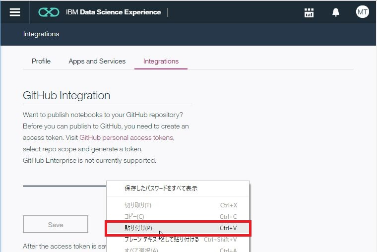
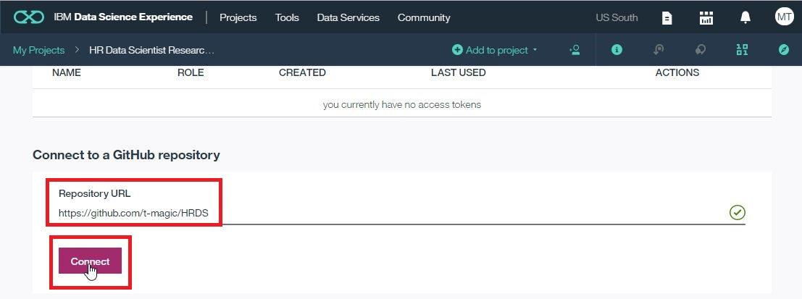
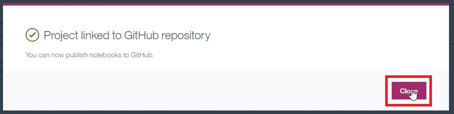
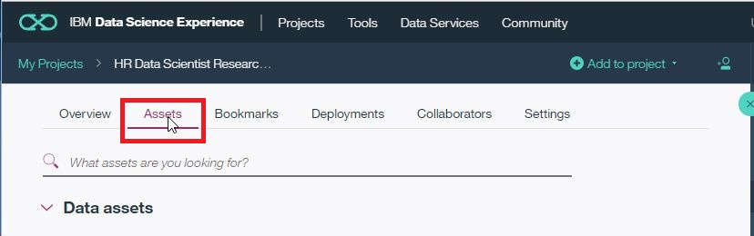
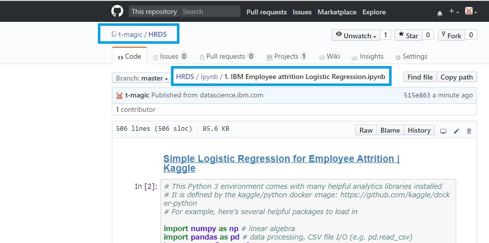

# DSX FAQ

# DSXに行くには
* IBM Data Science Experience([https://dataplatform.ibm.com/home?context=analytics](https://dataplatform.ibm.com/home?context=analytics) )に行きます。

 

* スクロールします。

 

* ノートブックを開きます。

 
 
---

## ノートブック(.ipynb)をアップロードするには

---

# ノートブックをインポートするには

---

## notebook名を変更するには

When you open your notebook, you should see an "I" "Notebook Info" icon (see below)

 you have to be in edit mode first. Then click on the "I" icon.  

There you can click on the Name field to change the notebook name.

---

## CSVファイルをアップロードして、ノートブックで使用するには

---

# GitHub、Gistへ保存するには

* [Publish notebooks on GitHub - IBM Data Science Experience](https://datascience.ibm.com/docs/content/analyze-data/github-integration.html)
* [Data Science Experience: Publish notebooks to Github](https://youtu.be/EplLENOla9I)  
視聴回数 249 回, 2:34  

---

