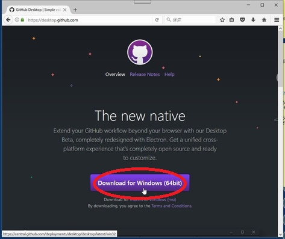
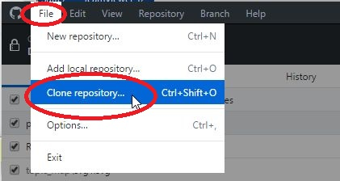
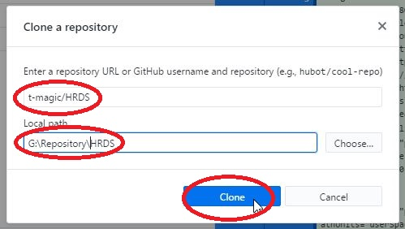
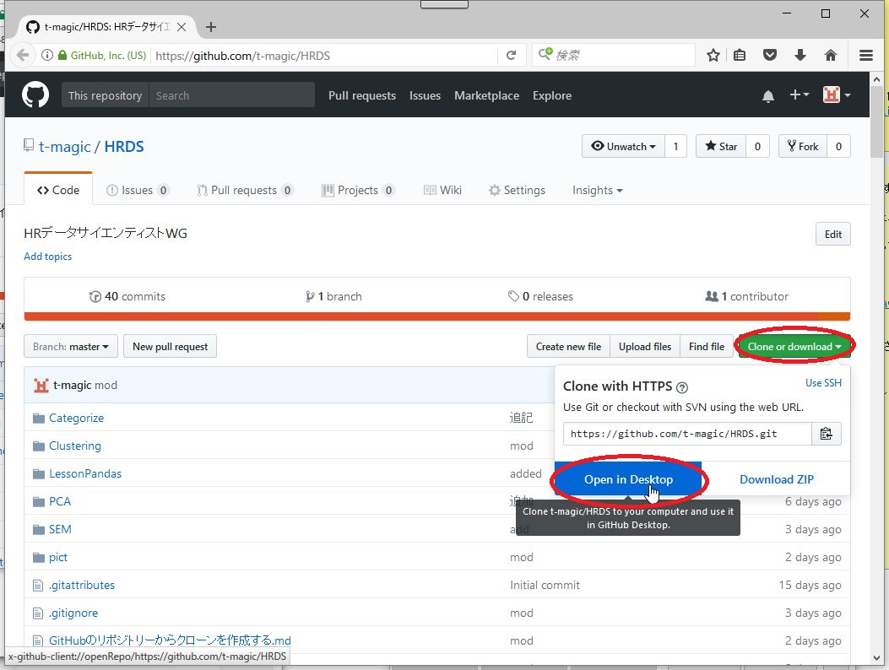
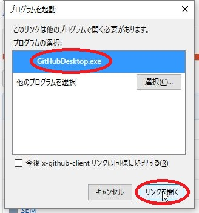
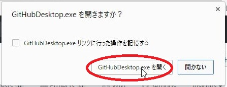
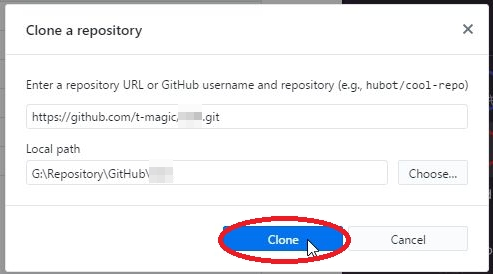

# GitHubのリポジトリーからクローンを作成する

1. https://desktop.github.com/ からGitHub Desktopをダウンロードして、インストールします。

 

1. インストール後、起動します。

 

1. FileメニューからClone repositor...を選択します。

 

1. リポジトリー名、クローンを作成する場所を指定し、Cloneボタンをクリックします。(ここではリポジトリー名がt-magic/HRDSで、ローカルの置き場所を (どこでもいいですが) G:\Repository\HRDSとしています。)

 

---

## 上の2からは、次のようにもできます。

 1. Clone or download をクリックし、Open in Desktop をクリックします。

 

 2. (Firefoxの場合)「リンクを開く」をクリックします。

  

 (Chromeの場合)「GitHubDesktop.exeを開く」をクリックします。

  

 3. Cloneをクリックします。

 

 ---

# Github Desktopを試そう

1. [GitHub公式クライアントでだれでも簡単GitHubライフをはじめよう](http://blog.tai2.net/github_client_howto.html)

1. [Github Desktopを使った開発の流れ(入門) - Qiita](http://qiita.com/RINDO/items/b7fac50289e9d5046ab9)

1. [イマドキのIDE事情 第25回GitHub Desktopとは?　｜　Geekroid](https://mynavi-agent.jp/it/geekroid/2016/01/ide-25github-desktop.html)

1. github desktop sync button
 * Github for Windows Tutorial (3 min) - How to fork, clone, change and push a repository

 

 * Github for Windows Tutorial (3 min) - How to fork, clone, change and push a repository

  

---

## [GitHub Desktopの使い方 - Qiita](http://qiita.com/yukiyan/items/2ea3dc5813fdba5d9cd2)

## [Github Desktopを使った開発の流れ(入門) - Qiita](http://qiita.com/RINDO/items/b7fac50289e9d5046ab9)

## [GitHub公式クライアントでだれでも簡単GitHubライフをはじめよう](http://blog.tai2.net/github_client_howto.html)

