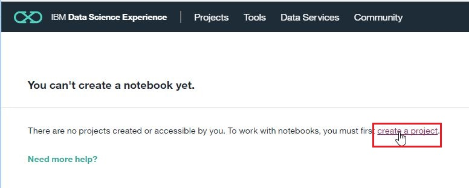

## 学習するには
* https://bigdatauniversity.com/

## IBM Cloud Light Accountをつくるには
* https://www.ibm.com/cloud-computing/jp/ja/bluemix/lite-account/

   

   

* アカウントの作成をします。

* ログインします。

   

   

   

   

   

   

* 以下は、操作がここで並べた順序ではないので、多少異なるかもしれません。

   * https://console-regional.au-syd.bluemix.net/

   

   

   

   

   

   

   

   

   

   

   

   

   

   

   

* ファイルのアップロードの方法がわからなかったので、聞いてみました。

   

   

* 説明通りにやってみました。

   

### ここに来るにはどうするかを振り返ってみます。

   

   

   

* さらに上までもどってみます。

   

   

   

   

## 最初はどこから始めるかを聞いてみます。
* https://dataplatform.ibm.com/home?context=analytics

   

   
