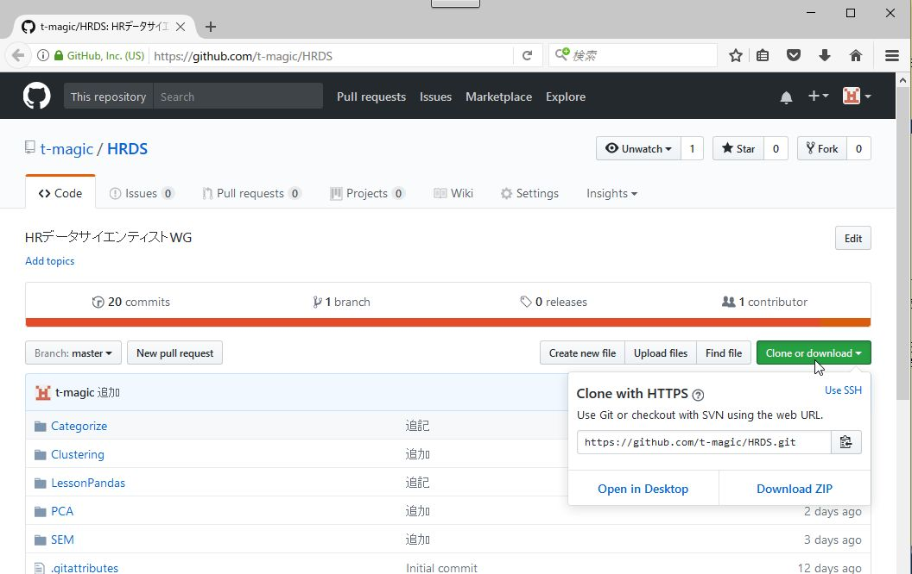
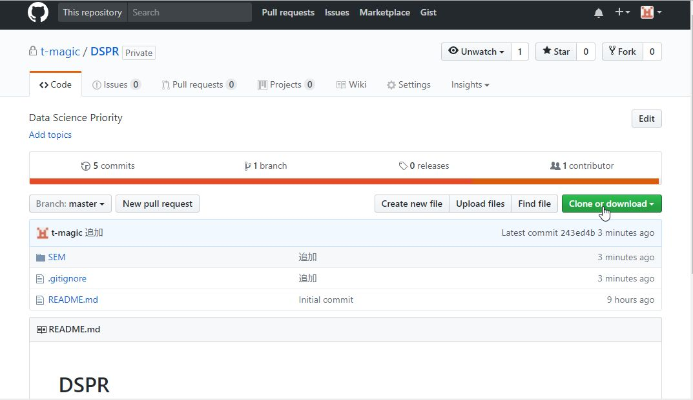

# HRDS

# 最初にすること
* 画像をクリックすると視聴できます。

## 1. Jupyterのインストール
* HRDataScientistWG 03 Jupyterのインストール

 
 * ここではPython3.5をインストールしていますが、最新版(3.6)をインストールしてください。

## 2. (できれば)GitHubのアカウント作成
アカウント作成後、ユーザー名をサイト管理者(舘野)にお知らせください。
* How to Create a GitHub Account • A Quick Look

 

または

* Git入門：GitHubのアカウントを作る｜lynda.com 日本版

 
* (先頭から1分34秒目～)

## 3. リポジトリーのダウンロード
#### GitHubのアカウント作成をしない場合
* https://github.com/t-magic/HRDS に行き、下図のようにして、ダウンロードしてください。

---

#### GitHubのアカウント作成をした場合

* https://github.com/t-magic/DSPR  に行き、下図のようにして、ダウンロードしてください。

[test](topic_map/Jupyter.ipynb)

[test](topic_map/Jupyter.html)

---

* HRデータサイエンティストWGで共有する情報をここに置きます。
  * [Lesson_01_Pandasを使ってみよう](LessonPandas/Lesson_01_Pandasを使ってみよう.html)
  * [Lesson_02_Pandasを使ってみよう2](LessonPandas/Lesson_02_Pandasを使ってみよう2.html)
* クラスタリング
  * [Clustering using K-Means with Titanic Dataset](Clustering/Clustering+using+K-Means+with+Titanic+Dataset.html)
  * [Trials of Flat and Hierarchical Clusterings with Titanic Data](Clustering/Trials+of+Flat+and+Hierarchical+Clusterings+with+Titanic+Data.html)
* カテゴライズ
  * [Random_Forests_%3D%3D_Awesome](https://github.com/mbernico/CS570/blob/master/module_2/Random_Forests_%3D%3D_Awesome.ipynb)
* リポジトリー
  * [github](https://github.com/t-magic/HRDS)
