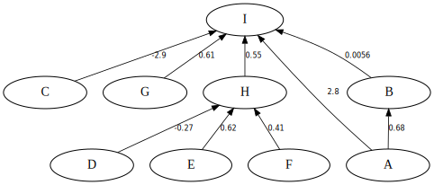
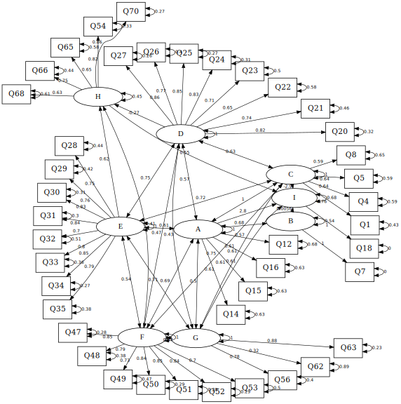

# SEM_Py

## Graphvizのインストール
分析結果を描画するためにGraphvizが必要です。[Graphviz | Graphviz - Graph Visualization Software](http://www.graphviz.org/) から [Download. | Graphviz - Graph Visualization Software](http://www.graphviz.org/Download..php) に移動し、一番下の「Accept」をクリックしてから、OSに応じて「windows」または「macos」をクリックしてインストーラーをダウンロードします。
(念のため、[ここ](graphviz/windows/graphviz-2.38.msi)にWindows用を置きます。)

デフォールトのままインストールします。


```python
%load_ext autoreload
%autoreload 2
```


```python
import sys
sys.path.append('progs')
from sem2dot import *
```


```python
pwd
```


    'G:\\Repository\\GitHub\\HRDS\\SEM'


```python
latency_list0 = select_latency_items('R_progs/latency0.R', encoding='cp932')
latency_list0
```


    ['潜在意識A',
     '潜在意識B',
     '潜在意識C',
     '潜在意識D',
     '潜在意識E',
     '潜在意識F',
     '潜在意識G',
     '潜在意識H',
     '潜在意識I']


### Graphvizの dot.exe の場所を以下のように指定します。
* シングルクォートでダブルクォートを括ります。


```python
dot_path = '"C:/Program Files (x86)/Graphviz2.38/bin/dot"'
```


```python
out2svg('data/sem_out0', latency_list0, dot_path, suffix = '_back_only', back_only = True)
out2svg('data/sem_out0', latency_list0, dot_path)
```



