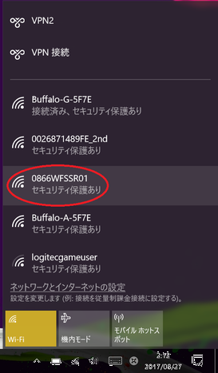

* 0866WFSSR01を探してクリックする。

 

* 「接続」をクリックする。

 

* パスワード: 09053052980

 

* 接続を確認する。

 

* http://10.10.10.254 でポケドラに接続する。

 

* 「ディスク」をクリックする。

 

* 「エクスプローラー」をクリックする。

 

* 「HRDS-master.zip」をクリックする。

 

* ダウンロードのアイコンをクリックする。

 

* 「DSPR」もダウンロードする場合は同様に行う。

 

* 接続を解除する。

 

 

* 通常のWIFIに接続する。

 

 
