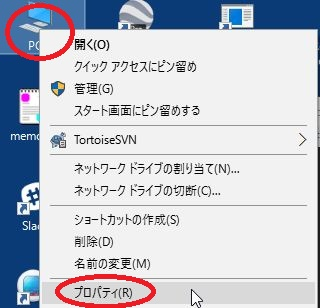
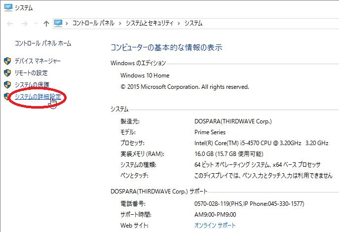
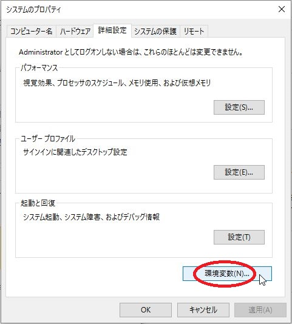
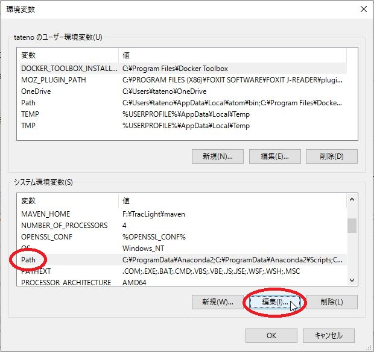
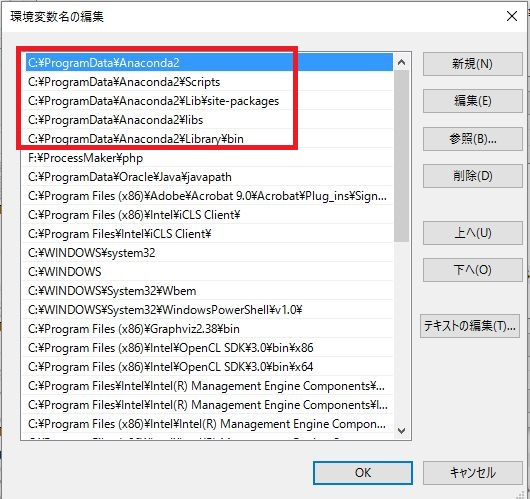

# 環境変数の確認

* 右クリックしてコンテクストメニューを表示し、プロパティを選びます。

 

* システムの詳細設定をクリックします。

 

* 環境変数をクリックします。

 

* Pathを選び、編集をクリックします。

 

* Jupyterでは、以下の五つのフォルダーの場所を環境変数から得ているようです。

 

 1. Anaconda3(または2)
 1. Scripts
 1. Lib\site-packages
 1. libs
 1. Library\bin
